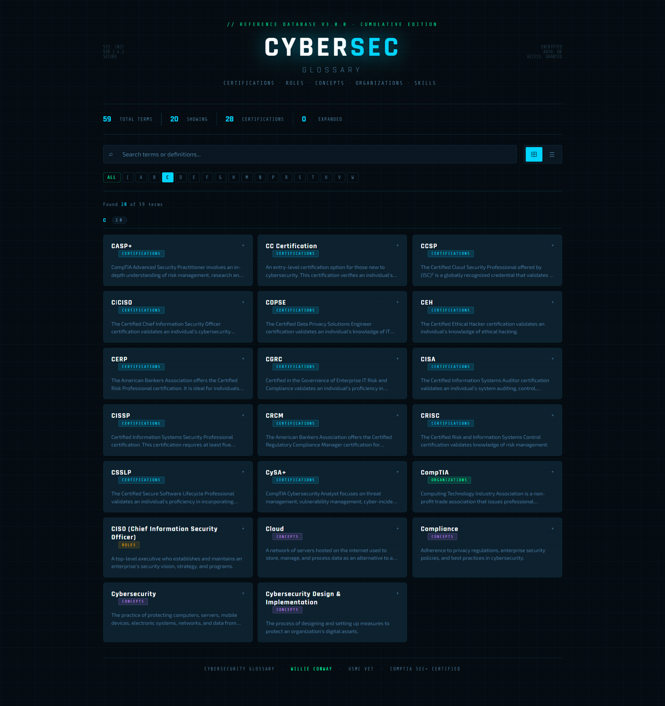
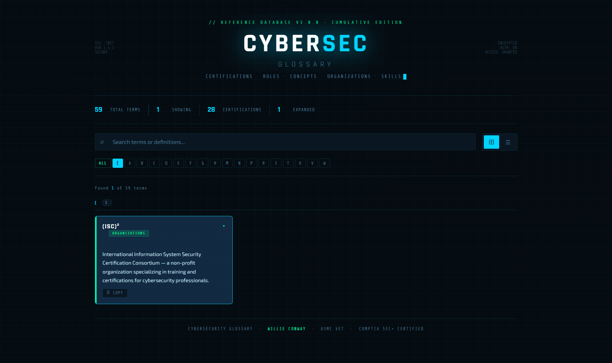

# 📖 CYBERSEC Glossary — Cybersecurity Reference Database


<p align="center">
  
  
  
  
</p>

---

## 🚀 Overview

**CYBERSEC Glossary** is a comprehensive cybersecurity reference database featuring **60+ terms** across **6 categories**, including **28 industry certifications** from major bodies like **CompTIA, (ISC)², and GIAC**. Designed for professionals and students, this interactive tool provides quick access to definitions, exam objectives, and career insights. Built with **HTML, CSS, and JavaScript**, it offers a responsive, terminal-style interface with **grid/list views** and **search functionality**.

---

## ✨ Key Features

### 📚 **Comprehensive Term Database** (60+ Terms)

| Category                 | Count | Description                                                |
| ------------------------ | ----- | ---------------------------------------------------------- |
| **Certifications** | 28    | Complete industry certifications from all major bodies     |
| **Organizations**  | 4     | Key certification and training organizations               |
| **Roles**          | 3     | Cybersecurity job roles and hacker classifications         |
| **Concepts**       | 16    | Core security concepts and principles                      |
| **Skills**         | 3     | Essential technical skills for cybersecurity professionals |
| **General**        | 5     | Career and statistical terminology                         |

### 🎯 **Certification Coverage**

#### **CompTIA** (7)

- ✅ **A+** — Foundational IT skills
- ✅ **Network+** — Networking fundamentals
- ✅ **Security+** — Core cybersecurity
- ✅ **CySA+** — Cybersecurity Analyst
- ✅ **PenTest+** — Penetration testing
- ✅ **CASP+** — Advanced Security Practitioner
- ✅ **CC Certification** — Entry-level cybersecurity

#### **(ISC)²** (5)

- ✅ **CISSP** — Certified Information Systems Security Professional
- ✅ **SSCP** — Systems Security Certified Practitioner
- ✅ **CCSP** — Certified Cloud Security Professional
- ✅ **HCISPP** — HealthCare Information Security
- ✅ **CGRC** — Governance of Enterprise IT Risk

#### **GIAC** (6)

- ✅ **GCED** — Enterprise Defender
- ✅ **GCIA** — Intrusion Analyst
- ✅ **GCIP** — Critical Infrastructure Protection
- ✅ **GICSP** — Industrial Cyber Security
- ✅ **GLEG** — Law of Data Security
- ✅ **GX-FA** — Experienced Forensic Analyst
- ✅ **GX-IH** — Experienced Incident Handler

#### **EC-Council** (2)

- ✅ **CEH** — Certified Ethical Hacker
- ✅ **C|CISO** — Certified Chief Information Security Officer

#### **ISACA** (3)

- ✅ **CISA** — Certified Information Systems Auditor
- ✅ **CRISC** — Certified Risk and Information Systems Control
- ✅ **CDPSE** — Certified Data Privacy Solutions Engineer

#### **Other** (5)

- ✅ **CERP** — Certified Risk Professional (ABA)
- ✅ **CRCM** — Certified Regulatory Compliance Manager (ABA)
- ✅ **PCIP** — PCI Professional
- ✅ **CC Certification** — ISC2 Entry-Level
- ✅ **C|CISO** — EC-Council Leadership

### 🔍 **Advanced Search & Filtering**

- **Real-time search** across terms and definitions
- **Alphabetical filtering** (A-Z) with letter navigation
- **Active filter count** showing results
- **Search highlighting** in both terms and definitions

### 📊 **Interactive Statistics**

```
┌─────────────────────────────────────┐
│  TOTAL TERMS: 60+                   │
│  SHOWING: 60                        │
│  CERTIFICATIONS: 28                  │
│  EXPANDED: 0                         │
└─────────────────────────────────────┘
```


### 🎨 **Dual View Modes**

| View                | Icon   | Description                          |
| ------------------- | ------ | ------------------------------------ |
| **Grid View** | `⊞` | Card-based layout with term previews |
| **List View** | `☰` | Compact list for quick scanning      |





### 📖 **Term Card Features**

- **Expandable definitions** with click-to-expand
- **Category color-coding** for visual identification
- **Definition preview** (collapsed view)
- **Copy button** for easy definition sharing
- **Highlighted search terms** in results




### 🎨 **Category Color Coding**

| Category                 | Color  | Hex         |
| ------------------------ | ------ | ----------- |
| **Certifications** | Cyan   | `#00d4ff` |
| **Organizations**  | Green  | `#00ff9d` |
| **Roles**          | Gold   | `#f0a500` |
| **Concepts**       | Purple | `#c084fc` |
| **Skills**         | Mint   | `#4ade80` |
| **General**        | Slate  | `#94a3b8` |

---

## 🚀 Quick Start

1. **Visit** 🌐 https://willie-conway.github.io/CYBERSEC-Glossary/
2. **Search** for terms using the search bar
3. **Filter** by first letter using the A-Z navigation
4. **Click any card** to expand the full definition
5. **Copy definitions** with the copy button
6. **Toggle views** between grid and list layouts

---

## 🎯 **Use Cases**

### **For Students** 📚

- Study for certification exams (Security+, CISSP, etc.)
- Look up unfamiliar terms while reading
- Build vocabulary for interviews
- Quick reference during study sessions

### **For Professionals** 💼

- Refresh knowledge on certification requirements
- Reference during security discussions
- Share definitions with colleagues
- Prepare for role transitions

### **For Career-Changers** 🚀

- Understand cybersecurity landscape
- Identify relevant certifications
- Learn industry terminology
- Navigate certification paths

---

## 🎨 **Design Philosophy**

### **Terminal Aesthetic** 💻

- **Dark background** (`#050a0f`) for reduced eye strain
- **Cyan glow** (`#00d4ff`) as primary accent
- **Scan line overlay** for retro terminal feel
- **Grid background** for technical depth
- **Blinking cursor** for authenticity

### **Typography** ✍️

- **Share Tech Mono** — Monospace for tags and stats
- **Rajdhani** — Headers and term names
- **Exo 2** — Body text for readability

### **Interactive Elements** 🎮

- **Hover effects** with cyan glow
- **Expansion animations** for definitions
- **Copy feedback** with success state
- **Active filter highlighting**
- **Staggered card animations**

---

## 🛠️ **Technical Implementation**

### **Architecture**

```
┌─────────────────────────────────────┐
│      CYBERSEC Glossary App           │
├─────────────────────────────────────┤
│                                     │
│  ┌─────────────────────────────┐   │
│  │      Data Layer             │   │
│  │  • TERMS array (60+ entries) │   │
│  │  • Categories: 6             │   │
│  │  • Certifications: 28        │   │
│  └─────────────────────────────┘   │
│                                     │
│  ┌─────────────────────────────┐   │
│  │      Filter Layer           │   │
│  │  • Alpha filter (A-Z)        │   │
│  │  • Search filter (real-time) │   │
│  │  • Combined filtering logic  │   │
│  └─────────────────────────────┘   │
│                                     │
│  ┌─────────────────────────────┐   │
│  │      View Layer             │   │
│  │  • Grid view (cards)         │   │
│  │  • List view (compact)       │   │
│  │  • Expandable cards          │   │
│  │  • Copy functionality        │   │
│  └─────────────────────────────┘   │
└─────────────────────────────────────┘
```

### **Key Functions**

```javascript
// Core filtering
getFilteredTerms()          // Apply both alpha and search filters
setFilter(letter)           // Set alphabetical filter
buildAlphaBar()              // Generate A-Z navigation

// Search & Highlight
highlight(text, query)       // Highlight search terms in results
escapeHtml(str)              // Sanitize HTML for security

// Rendering
render()                     // Main render function
grouped[letter]              // Group terms by first letter

// Interactivity
copyDef(e, btn, text)        // Copy definition to clipboard
expand/collapse              // Toggle definition visibility
```

### **Data Structure**

```javascript
{
  term: "CISSP",                    // Term name
  definition: "Certified Information...", // Full definition
  category: "Certifications"         // Category assignment
}
```

---

## 📊 **Category Breakdown**

| Category                 | Count | Examples                               |
| ------------------------ | ----- | -------------------------------------- |
| **Certifications** | 28    | A+, Security+, CISSP, CEH, CISA        |
| **Organizations**  | 4     | CompTIA, (ISC)², GIAC, EC-Council     |
| **Roles**          | 3     | CISO, White Hat, Black Hat             |
| **Concepts**       | 16    | Firewalls, Encryption, Risk Management |
| **Skills**         | 3     | Networking, Database, Permissions      |
| **General**        | 5     | Median, Range, Academic Pathways       |

---

## 🌐 **Browser Compatibility**

| Browser       | Support         |
| ------------- | --------------- |
| Chrome        | ✅ Full support |
| Firefox       | ✅ Full support |
| Safari        | ✅ Full support |
| Edge          | ✅ Full support |
| Opera         | ✅ Full support |
| Mobile Chrome | ✅ Responsive   |
| Mobile Safari | ✅ Responsive   |

---

## 🚦 **Performance**

- **Load Time**: < 0.5 seconds (zero external dependencies)
- **Memory Usage**: < 20 MB
- **Search Speed**: Instant (client-side filtering)
- **Network**: Zero requests after initial load

---

## 🛡️ **Security Notes**

The CYBERSEC Glossary is **completely safe**:

- ✅ No data collection
- ✅ No external scripts
- ✅ No tracking
- ✅ No cookies
- ✅ No network requests
- ✅ Pure static HTML/CSS/JS

---

## 📝 **License**

MIT License — see LICENSE file for details.

---

## 🙏 **Acknowledgments**

- **CompTIA** for certification standards
- **(ISC)²** for cybersecurity framework
- **GIAC** for practical certification focus
- **EC-Council** for ethical hacking standards
- **ISACA** for audit and risk frameworks

---

## 📧 **Contact**

- **GitHub Issues**: [Create an issue](https://github.com/Willie-Conway/CYBERSEC-Glossary/issues)
- **Website**: https://willie-conway.github.io/CYBERSEC-Glossary/

---

## 🏁 **Future Enhancements**

- [ ] Add more certification details (exam codes, requirements)
- [ ] Include salary ranges for roles
- [ ] Add certification path visualizations
- [ ] Include study resource links
- [ ] Add dark/light theme toggle
- [ ] Export definitions as PDF

---

<p align="center">
  <strong>📖 CYBERSEC Glossary — Your Complete Cybersecurity Reference Database 📖</strong>
</p>

---

*Last updated: March 2025*
